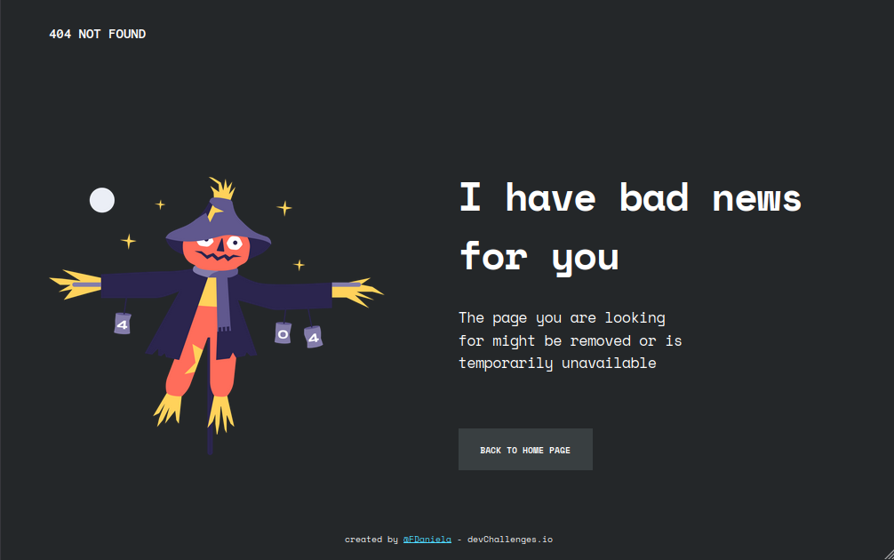
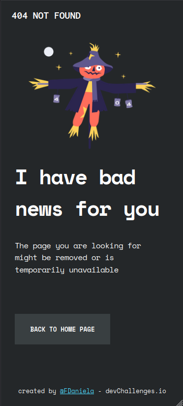

<h1 align="center">404 Not Found</h1>

   Solução do desafio da <a href="http://devchallenges.io" target="_blank">Devchallenges.io</a>.

## Challenge

Criar uma página de erro 404 não encontrada seguindo o design. A página deve ser responsiva. Atenda às histórias de usuário abaixo:

**História do usuário:** Eu posso ver uma página seguindo o design fornecido.

## Overview

    

    

