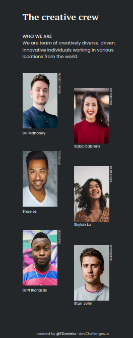
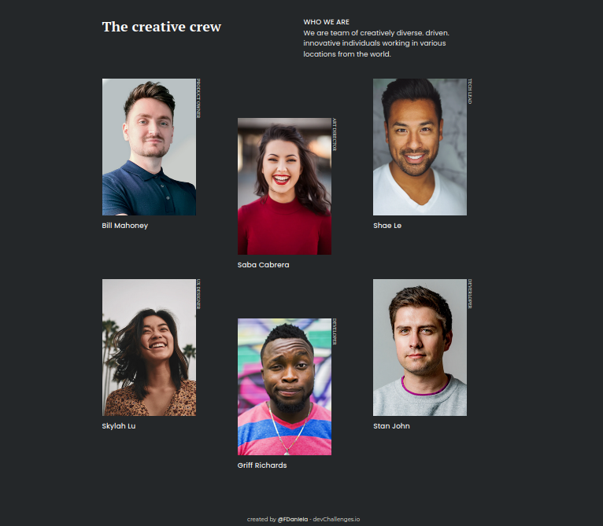

<h1 align="center">My team page</h1>

   Solução do desafio da <a href="http://devchallenges.io" target="_blank">Devchallenges.io</a>.

## Challenge

Criar uma página seguindo o [design](https://www.figma.com/file/F8d1qJsorEdY47N74HLxQ4/team-page-challenge?node-id=0%3A1&mode=dev). A página deve ser responsiva. Atenda às histórias de usuário abaixo:

**História do usuário:** Eu posso ver uma página seguindo o design fornecido.

## Overview

    

    

